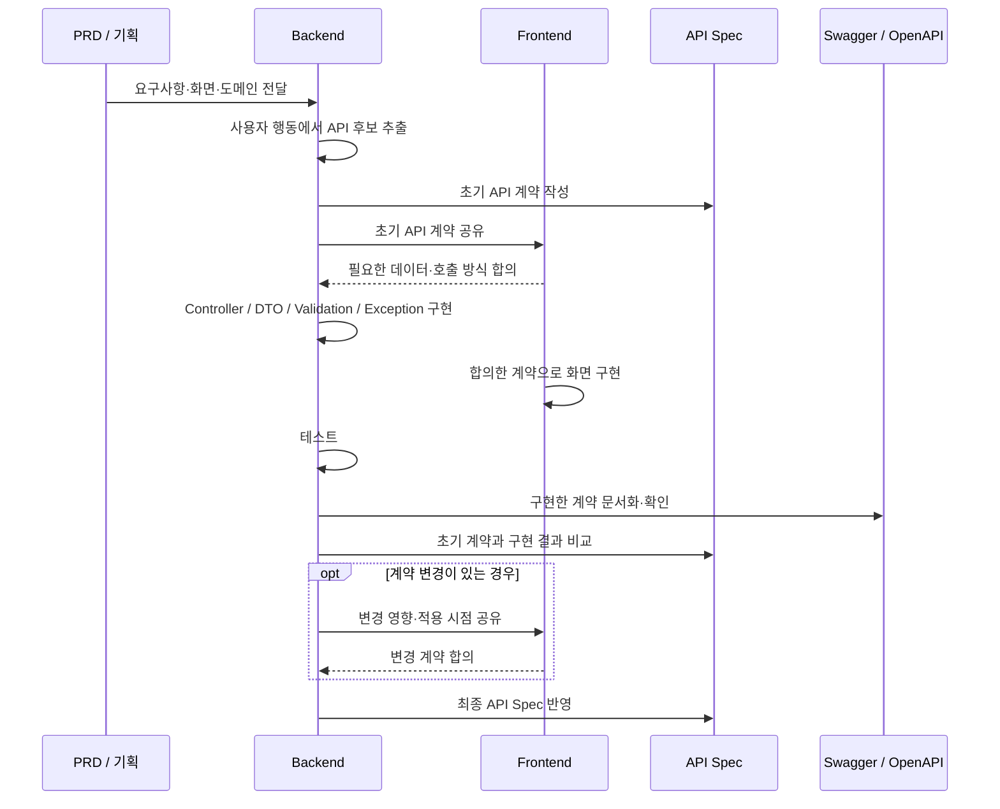
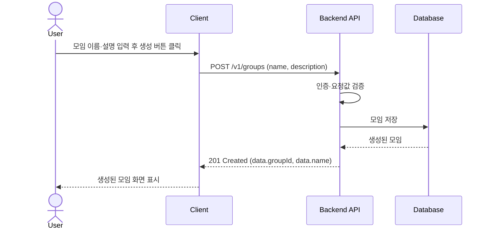

# Backend API Specification Guide (A&I)

이 문서는 Team-AnI 백엔드에서 API 명세를 작성하고 관리하는 공통 흐름을 정의합니다.
API Spec은 처음부터 완성된 문서를 만드는 작업이 아닙니다. 개발 전에 프론트엔드와 백엔드가 필요한 최소 계약을 맞춥니다.

## Quick Links

- [Backend Docs Index](./README.md)
- [Backend API Naming Guide (A&I)](./API_NAMING.md)
- [Backend API Common Exception Handling Guide v1](./COMMON_EXCEPTION_HANDLING_GUIDE_V1.md)

---

## 0. 문서 범위

- `.github/docs/backend`: Organization 공통 규칙과 API 명세 작성 흐름
- 각 서비스 Repository Wiki: 실제 API 상세 명세, 도메인별 상태·예외, 서비스별 구현 정책

이 문서는 작성 방법을 설명합니다. 실제 서비스의 API Spec은 각 서비스 Wiki에서 관리합니다.

---

## 1. API 명세 작성 흐름



---

## 2. PRD와 화면에서 API 찾기

PRD의 개발 범위를 확인하고, 화면의 사용자 행동마다 서버 처리가 필요한지 판단합니다. ERD는 다루는 Resource와 관계를 확인하는 데 사용합니다.

| 확인 대상 | 판단 기준 |
| --- | --- |
| PRD / Issue | 이번 개발 범위에 필요한 기능인가? |
| 화면 / 사용자 행동 | 누가 어떤 행동에서 호출하는가? |
| 서버 처리 | 데이터 조회·저장·상태 변경이 필요한가? |
| API 후보 | 어떤 Resource를 다루며 무엇을 보내고 받아야 하는가? |

- 화면의 모든 버튼이 API는 아닙니다. 탭 이동, Modal 열기/닫기, 입력 중인 값 변경은 프론트엔드 내부에서 끝날 수 있습니다.
- 화면 하나에 API 하나라는 규칙도 없습니다. 서로 다른 서버 작업이 필요하면 여러 API를 사용합니다.
- Entity가 있다고 CRUD를 전부 만들지 않습니다. 현재 PRD / Issue에 필요한 API만 설계합니다.

---

## 3. 초기 API 계약 작성

API 후보를 `기능 / Method / Endpoint / 설명 / 인증` 표로 정리한 뒤, 실제 구현할 API를 상세화합니다.

최소 계약에는 기능, HTTP Method, Endpoint, 인증/권한, Request, Response, 주요 HTTP Status를 포함합니다. 필드의 Type과 Required 여부도 함께 합의합니다.
확정되지 않은 제약이나 예외는 임의로 채우지 않고 Notes에 남깁니다.

---

## 4. 상세 API Spec Template

사용하지 않는 항목은 생략합니다. Method와 성공 Status는 해당 작업에 맞게 작성하고, 응답 JSON은 공통 Envelope를 사용합니다.

````md
## [기능명]

### Endpoint

`POST /v1/...`

### Description

API가 수행하는 작업을 간단히 작성합니다.

### Authorization

- Required / Not Required
- 필요한 역할이 있다면 작성

### Path Parameters

| Name | Type | Required | Description |
| --- | --- | --- | --- |

### Query Parameters

| Name | Type | Required | Description |
| --- | --- | --- | --- |

### Request Body

| Name | Type | Required | Description |
| --- | --- | --- | --- |

```json
{}
```

### Response

#### Success

Status: `201 Created`

```json
{}
```

### Error

| HTTP Status | Error Code | Description |
| --- | --- | --- |

### Notes

추가 제약 또는 구현 전 확인할 내용을 작성합니다.
````

---

## 5. Request / Response 작성 기준

- Request: **서버가 작업을 수행하기 위해 필요한 값**만 포함합니다.
- Response: **클라이언트가 다음 동작에서 실제로 사용하는 값**을 우선 포함합니다.

Database Entity는 저장 구조, Request / Response DTO는 클라이언트와의 계약입니다. Entity의 모든 Column을 그대로 노출하지 않습니다.

---

## 6. 공통 규칙

기존 공통 문서를 Source of Truth로 사용합니다.

| 항목 | 기준 문서 |
| --- | --- |
| URI / HTTP Method / Parameter Naming / 필드·날짜 표현 | [API Naming Guide](./API_NAMING.md) |
| Response Envelope / HTTP Status / Error Code | [Common Exception Handling Guide v1](./COMMON_EXCEPTION_HANDLING_GUIDE_V1.md) |

각 Endpoint에서 실제 발생하는 오류만 명세에 작성합니다. 서비스별 도메인 Error Code와 상세 정책은 해당 서비스 Wiki에서 관리합니다.

---

## 7. 구현 이후 명세 관리

Swagger/OpenAPI는 API를 대신 설계하는 도구가 아니라 **구현된 계약을 확인하고 공유하는 도구**입니다.
구현·테스트 후 실제 코드와 Swagger/OpenAPI를 초기 계약과 비교하고 서비스 Wiki의 최종 명세에 반영합니다.

| 비교 항목 | 확인 내용 |
| --- | --- |
| 호출 방식 | HTTP Method, Endpoint, 인증/권한, Path / Query Parameter |
| 데이터 | Request / Response Field, Type, Required 여부, Validation |
| 처리 결과 | HTTP Status, Error Code |

외부 계약이 같다면 내부 Service / Repository 수정은 API 계약 변경이 아닙니다. 위 항목이 바뀌면 클라이언트 영향을 확인하고 프론트엔드와 먼저 공유하여 적용 시점을 맞춥니다.

코드와 명세가 다르면 의도된 변경인지 확인합니다. 합의한 변경은 명세에 반영하고, 구현 오류는 수정 후 다시 테스트합니다.

---

## 8. 작성 예시: 모임 생성

아래는 **설명용 예시**이며 실제 Organization 정책이 아닙니다. 로그인한 사용자가 이름과 설명으로 모임을 생성하고, 클라이언트는 생성된 모임의 식별자와 이름을 사용한다고 가정합니다.

### 호출 흐름



### 초기 요약

| 기능 | Method | Endpoint | 설명 | 인증 |
| --- | --- | --- | --- | --- |
| 모임 생성 | POST | `/v1/groups` | 새로운 모임 생성 | Required |

### 상세 명세

Endpoint와 인증은 위 요약과 같으며, Path / Query Parameters는 사용하지 않습니다.

#### Request Body

| Name | Type | Required | Description |
| --- | --- | --- | --- |
| name | string | Yes | 모임 이름. 공백만 입력할 수 없음 |
| description | string | Yes | 모임 설명 |

```json
{
  "name": "백엔드 스터디",
  "description": "API 설계를 함께 공부하는 모임"
}
```

#### Response

Status: `201 Created`

```json
{
  "success": true,
  "data": {
    "groupId": 1,
    "name": "백엔드 스터디"
  },
  "error": null,
  "timestamp": "2026-03-11T10:00:00+09:00"
}
```

`data.groupId`는 number, `data.name`은 string이며 둘 다 반환합니다.

#### Error

| HTTP Status | Error Code | Description |
| --- | --- | --- |
| 400 | `VALIDATION_ERROR` | 필수 입력값 누락 또는 이름 공백으로 검증 실패 |
| 401 | `UNAUTHORIZED` | 인증되지 않은 요청 |

#### Notes

이름·설명의 길이 제한은 구현 전에 합의할 항목으로 남깁니다.

---

## 9. Checklist

### 개발 전

- [ ] PRD / Issue의 개발 범위를 확인했는가?
- [ ] 사용자 행동을 기준으로 API 후보를 찾았는가?
- [ ] 서버 처리가 실제로 필요한 동작인가?
- [ ] 필요하지 않은 CRUD를 추가하지 않았는가?
- [ ] API Naming Guide를 확인했는가?
- [ ] 프론트엔드와 최소 Request / Response를 합의했는가?

### 구현 중

- [ ] 초기 API 계약에서 변경된 내용이 있는가?
- [ ] 변경사항을 프론트엔드와 공유했는가?
- [ ] Validation / Status / Error가 의도한 계약과 일치하는가?

### 구현 완료

- [ ] 테스트가 통과하는가?
- [ ] Swagger/OpenAPI와 실제 구현이 일치하는가?
- [ ] 서비스 Wiki의 API Spec이 최신 상태인가?
- [ ] Error Response가 실제 구현과 일치하는가?

---

## References

외부 문서는 작성 형식을 참고하기 위한 자료입니다. Team-AnI 내부 규칙은 Organization 공통 문서를 우선합니다.

- [GitHub REST API Documentation](https://docs.github.com/en/rest): Method, Endpoint, Parameter, Request/Response 구성 참고
- [Swagger Petstore](https://petstore.swagger.io/): Swagger UI에서 API 명세가 표현되는 방식 참고
