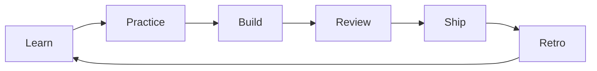

<!--
A&I Organization Profile
File: profile/README.md
This README is designed to be cohort-agnostic (reusable every year).
-->

  

  
  
  
  

  <b>🚀 A&amp;I</b>는 개발을 좋아하는 사람들이 모여 
  <b>지식을 공유하고, 협업하며, 프로젝트를 완주</b>하는 코딩 동아리입니다.

---

## 🌱 우리가 지키는 가치

### 1) 함께 성장 (Learn Together)
- 질문을 환영합니다.
- 기초부터 탄탄히, 서로의 성장을 돕습니다.

### 2) 끝까지 완주 (Finish What We Start)
- 작은 기능이라도 **Demo/Deploy까지** 가는 경험을 중요하게 생각합니다.
- “완성”을 통해 실력이 쌓인다고 믿습니다.

### 3) 읽히는 코드 (Readability First)
- 동작하는 코드에서 한 걸음 더: **읽기 쉬운 코드, 유지보수 가능한 코드**를 지향합니다.
- 리뷰는 비난이 아니라 **품질을 올리는 대화**입니다.

### 4) 신뢰 기반 협업 (Trust & Ownership)
- 약속(시간/범위/리뷰)을 지키는 문화를 중요하게 생각합니다.
- 맡은 부분은 끝까지 책임지는 **오너십**을 응원합니다.

---

## 🧭 우리가 하는 것

A&amp;I는 보통 아래 흐름으로 성장합니다 (세부 내용은 기수에 따라 조정될 수 있습니다):

- **Learn**: 기초 개념을 함께 학습
- **Practice**: 문제/과제로 손에 익히기
- **Build**: 팀으로 프로젝트 만들기
- **Review**: 코드리뷰로 퀄리티 끌어올리기
- **Ship**: 데모/배포로 “완주 경험” 만들기
- **Retro**: 회고로 다음 사이클 개선

---

## 🧩 트랙

> 트랙 구성/세부 커리큘럼은 기수에 따라 일부 조정될 수 있습니다.

### 📱 Flutter 과정 (Dart + Flutter)
1. Flutter를 이용한 **크로스플랫폼 앱**을 제작합니다.
2. **MVVM 패턴**, **상태관리(Provider, BLoC)** 를 이해하고 프로젝트에 적용합니다.
3. **클라우드 서비스**, **REST API**를 배우고 프로젝트에 적용합니다.

### 🧱 Spring Boot 과정 (Kotlin + Spring Boot)
1. Spring Boot 기반의 **서버**를 개발합니다.
2. **MVC 패턴**을 이해하고 프로젝트에 적용합니다.
3. **AWS + Docker(+Docker Compose) + GitHub Actions**로 서버를 배포하고 관리합니다.

### 🤖 AI 과정 (PyTorch)
1. 현재 AI의 **핵심 원리**를 학습합니다.
2. 실제 프로젝트에 적용 가능한 AI를 **직접 구현**하며 경험합니다.

---

## 📚 Engineering Handbook (규칙/가이드)

협업 품질은 “규칙 + 습관”에서 나옵니다. 아래 문서를 기준으로 맞춥니다:

- ✅ 커밋 컨벤션: **[COMMIT_CONVENTION.md](../docs/engineering/COMMIT_CONVENTION.md)**
- ✅ PR 작성 가이드: **[PR_GUIDE.md](../docs/engineering/PR_GUIDE.md)**
- ✅ PR/리뷰 가이드: **[PR_REVIEW_GUIDE.md](../docs/engineering/PR_REVIEW_GUIDE.md)**
- ✅ 클린 코드 가이드: **[CLEAN_CODE.md](../docs/engineering/CLEAN_CODE.md)**

---

## 🧑‍💻 처음 오신 분을 위한 10분 온보딩

1. **Engineering Handbook** 빠르게 훑기  
   - [COMMIT_CONVENTION.md](../docs/engineering/COMMIT_CONVENTION.md)  
   - [PR_GUIDE.md](../docs/engineering/PR_GUIDE.md)  
   - [PR_REVIEW_GUIDE.md](../docs/engineering/PR_REVIEW_GUIDE.md)  
   - [CLEAN_CODE.md](../docs/engineering/CLEAN_CODE.md)

2. 참여할 레포 하나 선택하기  
   - `A-AND-I-<Period>-CODE-LAB` 또는  
   - `A-AND-I-<Period>-PROJECT-<Team>` / `A-AND-I-<Period>-PROJECT-<Service>`

3. **첫 PR**로 가볍게 시작하기 (문서/예제/README 개선 추천)

4. PR 작성은 **PR_GUIDE**대로 “변경 내용 + 확인 방법”만 적으면 충분해요

---

## 🗂️ Repository (예시 구조)

- **Code Lab (실습/과제)**  
  - `A-AND-I-<Period>-CODE-LAB` : 실습/과제/예제 모음

- **Projects (팀 프로젝트)**  
  - `A-AND-I-<Period>-PROJECT-<Team>` 또는 `A-AND-I-<Period>-PROJECT-<Service>` : 팀 프로젝트 저장소

- **Docs (가이드/규칙)**  
  - `docs` : 규칙/가이드/회고 아카이브  
  - `.github` : Organization 프로필 및 공통 템플릿

---

## 🔒 Privacy Note

개인정보 보호를 위해, 공개 문서에는 운영진/멘토의 실명/연락처를 최소화합니다.  
상세 안내는 합류 이후 내부 채널에서 전달합니다.

---

  <b>Build. Review. Ship. Repeat.</b> 
  — A&amp;I Engineering Culture

